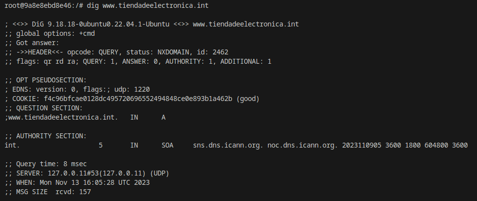
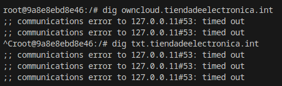
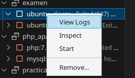
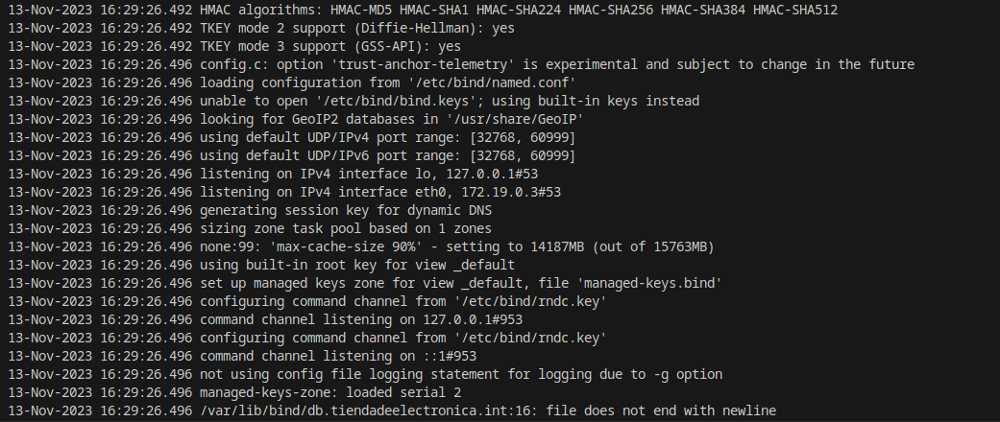
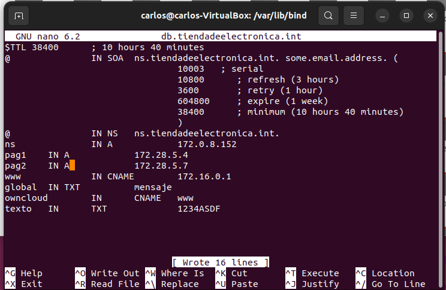
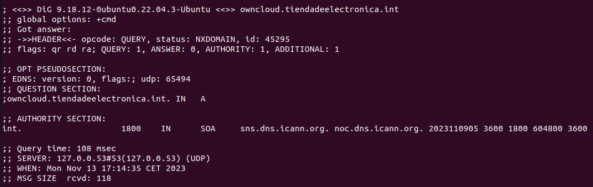
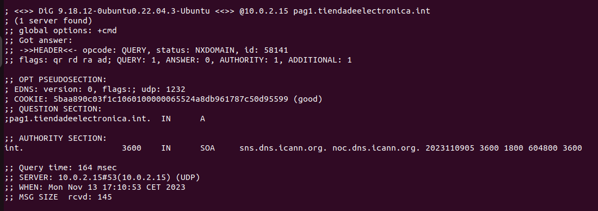
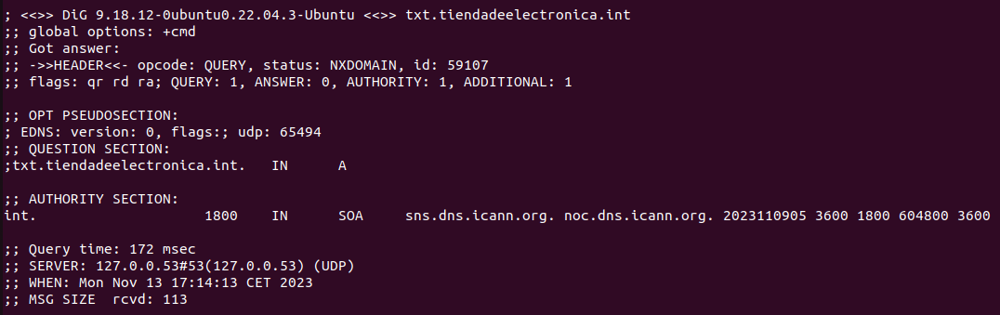
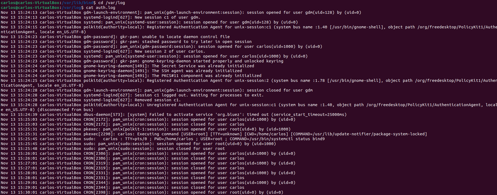

# examen-DNS

### Explica métodos para 'abrir' una consola/shell a un contenedor que se está ejecutando

Existen dos opciones, una de ellas sobre el contenedor hacer click derecho "attach shell", de esta forma se nos abriría la ventana con la terminal del contenedor, la otra usando el comando "exec", que tendría una sintaxis tal que asi.
~~~
docker exec -it contenedor bash
~~~

###  En el contenedor anterior con que opciones tiene que haber sido arrancado para poder interactuar con las entradas y salidas del contenedor

~~~
docker run -it --name miubuntu ubuntu bash
~~~

###  ¿Cómo sería un fichero docker-compose para que dos contenedores se comuniquen entre si en una red solo de ellos?

Pues lo principal para hacer esto seria que ambos estuvieran en la red, tendrias que tener un docker compose que se pareciera al siguiente.
~~~
services:
 asir_contenedor1:
   image: httpd:2.4
   ports:
     - "8000:80"
   volumes:
     - ./paginas:/usr/local/apache2/htdocs 
   container_name: asir_contenedor1
   networks:
     my-network:

 asir_contenedor2:
   image: httpd:2.4
   ports:
     - "9080:80"
   volumes:
     - ./paginas:/usr/local/apache2/htdocs 
   container_name: asir_contenedor2
   networks:
     my-network:

networks:
   my-network:
     ipam:
       config:
         - subnet: 172.28.0.0/16
           gateway: 172.28.0.1
~~~

De esta forma se encontrarian todos los clientes en la misma subred, y como no tienen ips se les asignaria por dhcp.

###  ¿Qué hay que añadir al fichero anterior para que un contenedor tenga la IP fija?

Muy sencillo en el espacio de networks my network tendriamos que añadir una linea que fuera ipv4 con una sintaxis asi:
~~~
 asir_contenedor2:
   image: httpd:2.4
   ports:
     - "9080:80"
   volumes:
     - ./paginas:/usr/local/apache2/htdocs 
   container_name: asir_contenedor2
   networks:
     my-network:
       ipv4_address: 172.28.0.40
~~~

### ¿Que comando de consola puedo usar para saber las ips de los contenedores anteriores? Filtra todo lo que puedas la salida.

~~~
docker inspect --format '{{.Name}} - {{range .NetworkSettings.Networks}}{{.IPAddress}}{{end}}' $(docker ps -aq)
~~~

### ¿Cual es la funcionalidad del apartado "ports" en docker compose?

La sección ports en un archivo docker-compose.yml se utiliza para especificar cómo se deben mapear
los puertos entre el host y el contenedor. Permite definir cómo las aplicaciones dentro de los
contenedores pueden ser accedidas desde el host o desde fuera de la red del contenedor.

Esto es sumamente importante si trabajamos con varios contenedores, pues si no especificamos los puertos todos irian por el mismo

### ¿Para que sirve el registro CNAME? Pon un ejemplo

El registro de "CNAME" significa nombre canónico y su función es hacer que un
dominio sea un alias para otro. El CNAME generalmente se utiliza para asociar nuevos
subdominios con dominios ya existentes de registro A.  
Supongamos que tienes dos nombres de dominio:  
www.ejemplo.com: Este es tu dominio principal donde está alojado tu sitio web. 
blog.ejemplo.com: Quieres que este subdominio apunte al mismo lugar que www.ejemplo.com.  
Para lograr esto, puedes usar un registro CNAME en tu configuración DNS:  
blog.ejemplo.com. IN CNAME www.ejemplo.com. 
En este ejemplo: 
blog.ejemplo.com: Es el subdominio para el cual estás configurando el CNAME. 
CNAME: Indica que este es un registro CNAME. 
www.ejemplo.com.: Es el nombre canónico al cual el subdominio apunta. 

###  ¿Como puedo hacer para que la configuración de un contenedor DNS no se borre si creo otro contenedor?

Mientras lo hagas con un docker compose lo tienes guardado siempre con la misma configuración,
además de que docker de base guarda los contenedores a no ser que tu de forma activa busques
eliminarlos.

###  Añade una zona tiendadeelectronica.int en tu docker DNS que tenga
www a la IP 172.16.0.1  
owncloud sea un CNAME de www 
un registro de texto con el contenido "1234ASDF" 
Comprueba que todo funciona con el comando "dig" 
Muestra en los logs que el servicio arranca correctamente    

en este caso nuestro documento db.tiendadeelectronica.int nos quedaria asi
~~~
$TTL 38400	; 10 hours 40 minutes
@		IN SOA	ns.tiendadeelectronica.int. some.email.address. (
				10003   ; serial
				10800      ; refresh (3 hours)
				3600       ; retry (1 hour)
				604800     ; expire (1 week)
				38400      ; minimum (10 hours 40 minutes)
				)
@		IN NS	ns.tiendadeelectronica.int.
ns		IN A		172.0.8.152
pag1	IN A		172.28.5.4
pag2	IN A 		172.28.5.7
www		IN CNAME	172.16.0.1
global	IN TXT		mensaje
owncloud	IN	CNAME	www
texto	IN	TXT		1234ASDF
~~~

entonces con esto ya hecho el siguiente paso seria comprobar que todo funcione con nuestros comandos 
~~~
dig @172.0.8.152 www.tiendadeelectronica.int
dig owncloud.tiendadeelectronica.int
dig txt.tiendadeelectronica.int
~~~

por los fallos que he estado teniendo en el examen no he conseguido reparar el problema de la red pero se veria esto con una respuesta de answer 

 aqui ya me dio el fallo fatal y aun teniendo el documento principal bien no he conseguido que funcione 

Por ultimo paso para ver los logs simplemente tenemos que ir a nuestro contenedor click derecho "view logs"

Cuando le clicamos nos abrira una terminal con los logs de nuestro contenedor

###  Realiza el apartado 9 en la máquina virtual con DNS

Primero tenemos que crear el documento db.tiendadeelectronica.int que podemos copiarlo del anterior ejercicio y nos quedaria algo tal que asi:

Ahora con esto hecho tendremos que comprobar que los digs funcionen (el resto de documentos ya fueron creados con anterioridad)

para ver los logs simplemente tenemos que hacer los siguientes comandos
~~~
cd /var/log
cat auth.log
~~~

y se veria algo asi

podriamos tambien hacer un grep para ver los cnamed y variantes del mismo por si queremos buscar algo en especifico pero de esta forma comprobamos los logs

